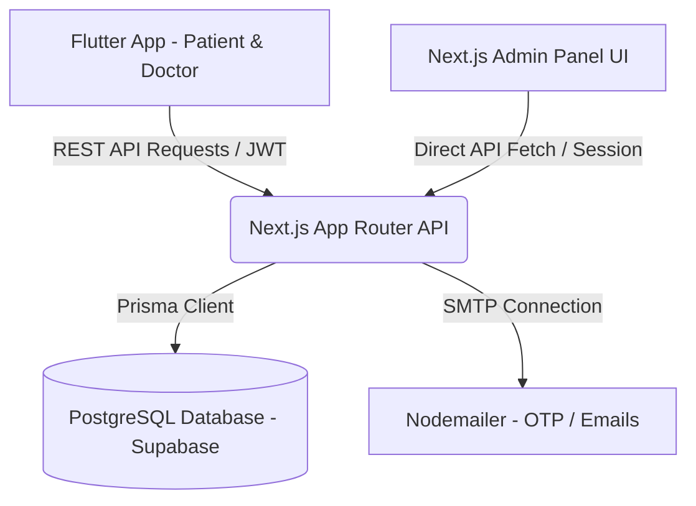

<h1 align="center">Hey 👋 I'm Sathath Mohamed Afham</h1>
<h3 align="center">Software Engineer  | Full Stack Developer | Computer Science Undergraduate</h3>

---

<p align="center">
  
</p>

---

## 👨‍💻 About Me

🎓 Undergraduate Computer Science Student at Eastern University of Sri Lanka  
💻 Passionate Full Stack Developer specialized in MERN Stack Development  
🚀 Interested in Web Development, DevOps, Cloud Technologies, and Scalable Applications  
🌱 Currently learning advanced backend architectures and mobile application development  
🇱🇰 From Sri Lanka  

---

## 🔗 Connect With Me

<p align="left">
<a href="https://github.com/AfhamSathath" target="blank">

</a>

<a href="https://www.linkedin.com/in/afham-sathath-6182222b1" target="blank">

</a>

<a href="mailto:afhamsathath2002@gmail.com">

</a>
</p>

---

## 🛠️ Languages & Tools

<p align="left">


</p>

---

## 🚀 Featured Projects

### 🎓 Unified Career & Education Platform for Sri Lanka
- Full-stack MERN application with Admin, User, and Company dashboards
- Qualification-based course and job matching system
- Company verification and fraud prevention features

🔗 Repository:  
https://github.com/AfhamSathath/afhamsathath.github.io

---

### 📝 Examination Paper Moderation & Repository System
- Secure academic moderation and approval workflow system
- Role-based access control with audit trails
- Real-time notifications and centralized repository

🔗 Repository:  
https://github.com/AfhamSathath/exam-manager-pro-main

---

### 👨‍💼 Skills & Resource Management System
- Real-time personnel and project matching platform
- Skill tracking and intelligent allocation system
- Workload forecasting dashboard with analytics

🔗 Repository:  
https://github.com/AfhamSathath/Personnal-Web

---

### 🏢 RDD Stationary Request Management System

- Full-stack web application for managing stationary requests across multiple department branches
- Secure branch and admin authentication with role-based access and Row Level Security (RLS)
- Automatic request summaries, PDF report generation, and request status management

🔗 Repository:  
https://github.com/AfhamSathath/rdd-stationary-system

Deployment: 
https://rdd-stationary-system.vercel.app


# DocTime: Full-Stack Doctor Appointment & Telemedicine System

DocTime is a full-stack, multi-platform doctor appointment booking and consultation system. It features a **Flutter mobile app** (for both Patients and Doctors) and a **Next.js admin web panel** powered by a unified **REST API backend** built with Next.js App Router, Prisma ORM, and PostgreSQL (Supabase).

---

## 🚀 Key Features

### 📱 Mobile Application (Flutter - Patient & Doctor Roles)

#### **For Patients:**
- **Doctor Discovery:** Search and filter doctors by specialty, location, experience, and consultation fees.
- **Appointment Booking:** Seamlessly book appointments by choosing active days and timeslots synced with the doctor's calendar.
- **Consultation Feedback:** Rate and review doctors after consultations to help build a trustworthy community.
- **Prescription Viewer:** Download and view digital prescriptions in PDF format generated directly after consultation.
- **In-App Messaging:** Secure real-time chat with doctors before and after sessions.

#### **For Doctors:**
- **Dashboard Overview:** Track scheduled appointments, upcoming appointments, and daily metrics.
- **Availability Management:** Customize available days, hours, and maximum bookings per day via an interactive calendar.
- **Prescription & Medical Records:** Generate digital prescriptions for appointments, complete with digital signatures and stamps.
- **Patient History:** Review patient profiles and notes before consultations.

---

### 💻 Administrator Web Portal (Next.js - Admin Role)
- **Analytics Dashboard:** Real-time metrics tracking total doctors, patients, appointments, and overall platform revenue.
- **User Accounts Management:** View, activate, deactivate, and manage doctor credentials and patient accounts.
- **Appointments Overview:** Comprehensive registry of all current, pending, completed, and cancelled appointments.
- **Financial Tracker:** Overview of platform transaction IDs, payment methods, and revenue distributions.

---

## 🛠️ Technology Stack

| Layer | Technology | Key Libraries / Frameworks |
| :--- | :--- | :--- |
| **Mobile App** | **Flutter (Dart)** | State Management (`Provider`), Local Storage (`shared_preferences`), Icons (`lucide_icons`), Networking (`http`), PDF Handling (`syncfusion_flutter_pdf`, `pdf`) |
| **Web & API Backend**| **Next.js 16 (React 19)** | TypeScript, Tailwind CSS v4, App Router REST APIs |
| **Database** | **PostgreSQL** | Hosted on **Supabase** |
| **ORM** | **Prisma** | Database migration, type-safe queries, client generation |
| **Authentication** | **JWT & bcryptjs** | Stateless JSON Web Token authentication with securely-hashed password storage |
| **Email/Alerts** | **Nodemailer** | SMTP integration for user registration OTPs and email notifications |

---

## 📐 System Architecture

The application implements a decoupled architecture:
1. **Backend / API (Next.js):** Acts as the single source of truth, hosting standard REST API endpoints (under `/api/*`) secure by JWT bearer auth.
2. **Database Layer (Prisma + Supabase):** A cloud relational database storing system details securely.
3. **Web Frontend (Next.js Client Components):** An admin panel built with React components using CSS layout styles.
4. **Mobile Frontend (Flutter):** Multi-platform app compiled natively for Android & iOS, interacting with backend services through stateless REST calls.



---

## 💾 Database Schema Details

The database is built on **PostgreSQL** with relationships managed through **Prisma**:

- **User & UserRole:** Represents credentialed accounts (email, password hash, role classification).
- **Doctor:** Linked to User; contains metadata such as specialty, ratings, consultation fees, custom availability rules, and digital signature locations.
- **Appointment:** Connects `User` (as patient) and `Doctor`; logs scheduling (`date`, `time`), current status (`pending`, `completed`), payment status, transaction ID, prescription URL, rating score, and text reviews.
- **Message:** Logs internal communication history between users (`senderId`, `receiverId`, `text`).
- **Notification:** Manages delivery of system alerts and read/unread statuses.

---

## 💻 Setup and Installation

### Prerequisites
- Node.js (v18+)
- Flutter SDK (v3+)
- PostgreSQL Database Instance (e.g. Supabase)

### Backend & Web Admin Setup
1. Clone the project and navigate to the `web` folder.
2. Install dependencies:
   ```bash
   npm install
   ```
3. Set up the `.env` file:
   ```env
   DATABASE_URL="your-postgresql-connection-string"
   JWT_SECRET="your-jwt-secret-key"
   SMTP_HOST="smtp.gmail.com"
   SMTP_PORT=587
   SMTP_USER="your-email@gmail.com"
   SMTP_PASS="your-app-password"
   ```
4. Push the database schema:
   ```bash
   npx prisma db push
   ```
5. Start the web application:
   ```bash
   npm run dev
   ```

### Mobile App Setup
1. Navigate to the `mobile` folder.
2. Configure the server base URL in `lib/services/api_service.dart`:
   ```dart
   static String get baseUrl => 'http://<your-local-ip>:3000/api';
   ```
3. Install packages and run:
   ```bash
   flutter pub get
   flutter run
   ``` based on this give a small paragraph to added suitable my portpolio
## 📊 GitHub Stats

<p align="center">

</p>

<p align="center">

</p>

---

## 📚 Education

🎓 **Bachelor of Computer Science**  
Eastern University of Sri Lanka  
2022 – Present

🏫 **G.C.E Advanced Level – Physical Science**  
T/Kin/Kinniya Central College  
2019 – 2021

---

## 📜 Certifications

- UI/UX Design (Introduction to Figma) – Simple Learn Online Tutor
- Maths Genius Short Course – IRO College
- Leadership Programme – OMSED

---

## 💡 Additional Skills

✔ Web Programming  
✔ RESTful API Development  
✔ Database Management  
✔ Communication Skills  
✔ MS Office Packages  

---

## ⚡ Fun Fact

💡 I enjoy turning ideas into real-world software solutions.
